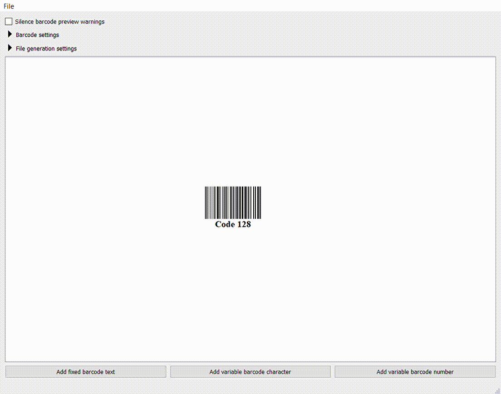

# Code128_barcode_generator

The creation of this project stemmed from the need to manually create files with pages containing barcodes in a specific layout. I decided to automate it. It was supposed to be a simple console application taking single input and creating a file tailored to my needs. But then requirements for this file changed. Again and again. Layout, page size, how the text under the barcode is divided... and here we are. 
I present an application that allows the generation of PDF files containing barcodes with a fairly wide range of customization. Both in terms of the appearance of the barcode itself and the entire pages of the resulting file.

## Installing
Download the files contained in the .zip from releases and execute Code128_barcode_generator.exe.

## Features
+ **2 ways of generating file:** You can use the GUI to add constants and variable parts of the barcode, or load a file in csv format.
+ **Barcode customization:** The height and width of the barcode as well as the size of the text, whether it is to be displayed, and even the possibility to divide it into parts of a chosen size to improve readability. 
+ **File customization:** Page dimensions as well as the number of barcodes that should appear on a single page.
+ **Barcode preview:** Single barcode preview, which changes automatically as the barcode text or settings change. 
+ **Barcode/file customization warnings:** The application will warn you if your changes to barcode or file settings would make it impossible to create the file. 
+ **Easily extendable structure:** ...at least in terms of adding other barcode types for encoding. Prepared interfaces and the example of their implementation for code128 should be clear and allow for the efficient development.

For those who would rather see it in action, wait a moment, gif with a simple demo is loading beneath. 
Unfortunately, the technology which I am using does not record pop-up warnings/menus, but there was a warning when my barcode's width exceeded page's width. If you would want to see the resulting file with barcodes it is in **demo** directory.

## Built with
Qt 5.15.

## License
This project is licensed under GPLv3 license.

## Possible development
+ other barcode types for encoding
+ list of page sizes and ability to add custom ones
+ changing single barcode preview to single page preview
+ wider file/page customization in terms of barcodes layout
